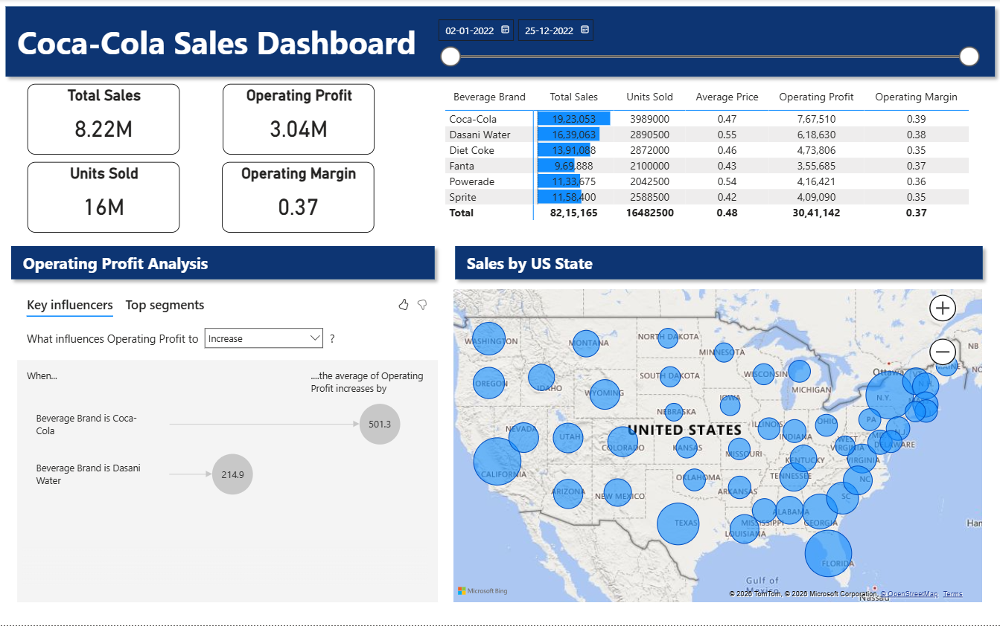

# 🥤 Coca-Cola Sales Dashboard | Power BI

An interactive and visually rich **Power BI dashboard** designed to analyze and track Coca-Cola sales performance across different beverage brands, regions, and time periods.

---

## 📊 Project Overview

This project provides a comprehensive sales analysis of Coca-Cola products using Power BI. It helps users gain insights into:

- Total Sales & Profit performance  
- Units Sold across different products  
- Operating Margin trends  
- Brand-wise contribution  
- State-wise sales distribution in the US  

The dashboard is built to support **data-driven decision-making** with intuitive visuals and filters.

---

## 🚀 Key Features

- 📌 **KPI Cards**
  - Total Sales
  - Operating Profit
  - Units Sold
  - Operating Margin  

- 📅 **Dynamic Date Filter**
  - Analyze data across custom time ranges  

- 🥤 **Brand-wise Analysis**
  - Coca-Cola  
  - Dasani Water  
  - Diet Coke  
  - Fanta  
  - Powerade  
  - Sprite  

- 📈 **Operating Profit Analysis**
  - Key influencers affecting profit increase  

- 🗺️ **Geographical Insights**
  - Interactive map showing sales by US states  

- 📊 **Detailed Metrics Table**
  - Sales, Units Sold, Average Price, Profit & Margin  

---

## 🖼️ Dashboard Preview



---

## 📂 Project Structure

```
📁 coca-cola-sales-dashboard-powerbi
│── 📁 data                # Dataset files
│── 📁 images              # Dashboard screenshots
│── coca_cola_sales_dashboard.pbix  # Power BI file
│── README.md
│── LICENSE
```

---

## ⚙️ Tools & Technologies

- Power BI – Data visualization & dashboard creation  
- Excel / CSV – Data source  
- Bing Maps (Power BI) – Geographical visualization  

---

## 📌 How to Use

1. Download the `.pbix` file from this repository  
2. Open it in Power BI Desktop  
3. Explore:
   - Filters (Date range)
   - Brand performance
   - Regional insights  

---

## 🎯 Use Cases

- Sales performance tracking  
- Business intelligence reporting  
- Market analysis by region  
- Product performance comparison  

---

## 🤝 Contributing

Contributions are welcome!  
Feel free to fork this repo and submit a pull request.

---

## 📜 License

This project is licensed under the MIT License.

---
